## My GPT

### Passo 1: Fazer Login e Selecionar GPT-4

1. Faça login na sua conta.
   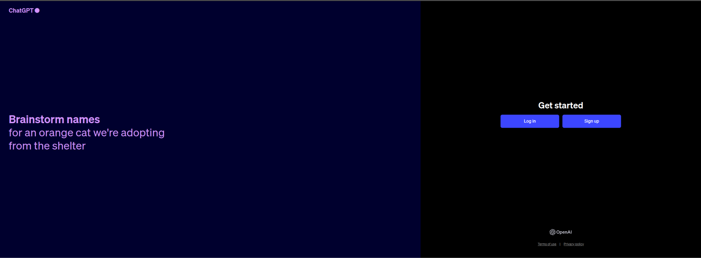
   
2. No painel inicial, selecione "GPT-4" como o modelo que deseja personalizar.
   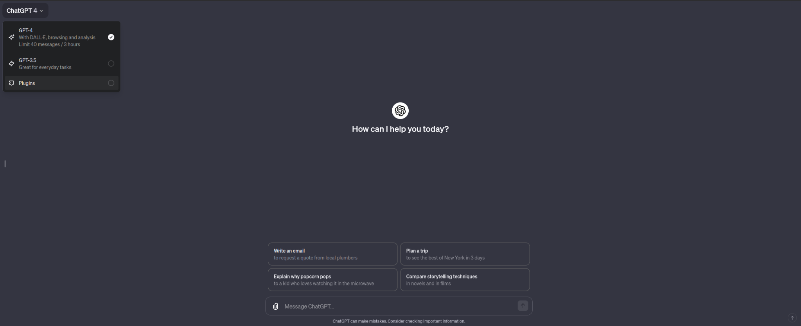

### Passo 2: Selecionar Seu GPTS

1. No canto inferior esquerdo da tela, você verá a opção "My GPTS".
   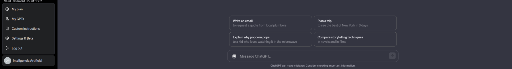

2. Clique nela e selecione o GPTS que você deseja associar ao seu projeto.
   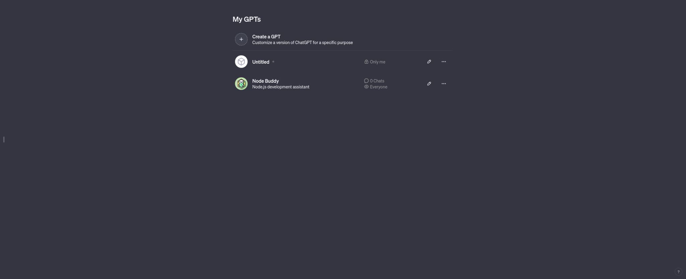

### Passo 3: Criar GPT Personalizado

1. No menu superior, escolha a aba "Create" para começar a criar o seu GPT personalizado.
   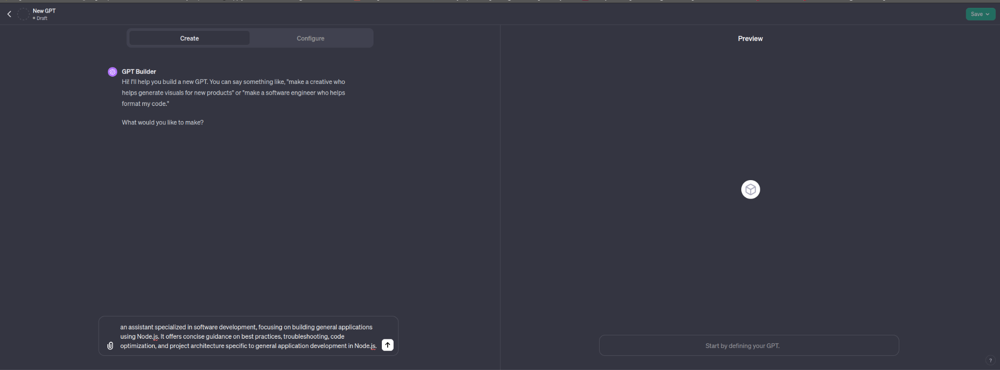

2. Siga as instruções fornecidas na interface para configurar seu GPT conforme desejado.

   - Escolha o nome do seu modelo.
   - Escolha as tarefas específicas que deseja que seu modelo seja capaz de realizar.

   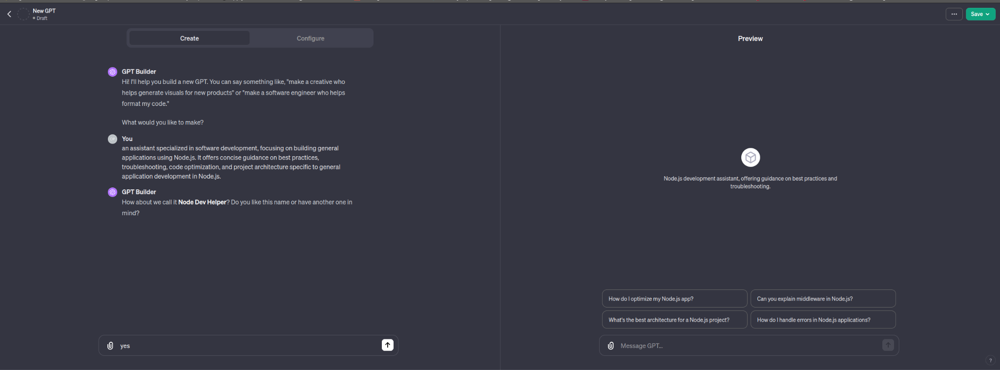
   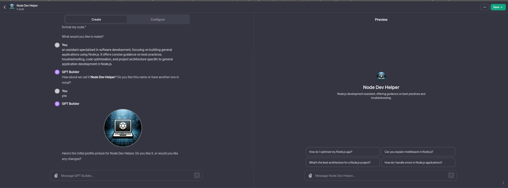
   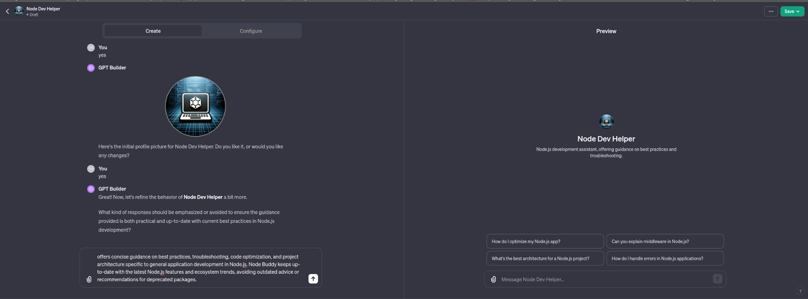
   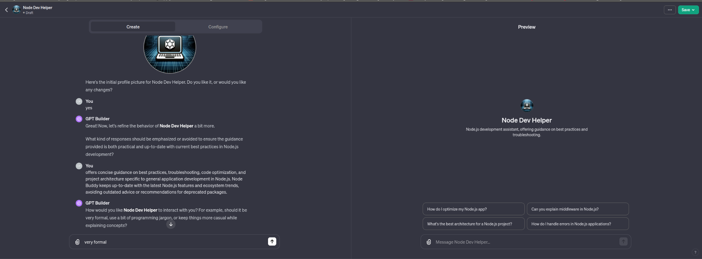

### Passo 4: Publicar na Loja

1. Selecione a opção de publicação e selecione "everyone" em "publish to" disponibilizado publicamente.

   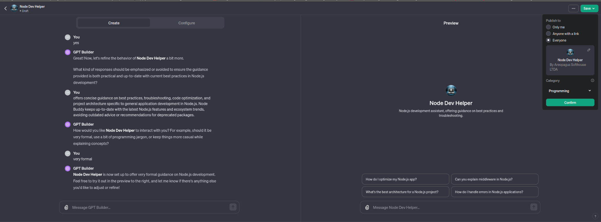

### Passo 5: Compartilhar e Usar

Explore as possibilidades e aproveite o poder do seu GPT personalizado!

Vá em https://chat.openai.com/gpts em no searchbox você deve encontrar seu chat publicado.

## Usar o GPT em seu app

### Criar Assistants

Para criar um assistente na plataforma da OpenAI, siga estes passos simples:

1. **Acesso à sua Conta:**

   - Faça login em sua conta na plataforma da OpenAI.
   - Navegue até https://platform.openai.com/api-keys e clique na opção "Assistants".

2. **Iniciar a Criação:**

   - No canto superior direito da página, clique em "create".

3. **Preencher Detalhes:**

   - Insira um nome para o seu assistente.
   - Nas instruções, você pode fornecer detalhes sobre o tipo de assistente que deseja criar. Por exemplo, você pode usar uma descrição semelhante à fornecida na pergunta "What would you like to make?" nas etapas para a criação do chat.

4. **Selecionar Modelo e Opção:**

   - Escolha o modelo GPT-4 na lista de modelos disponíveis.
   - Marque a opção "Code interpreter" para garantir que o assistente possa interpretar e responder a perguntas relacionadas a código.

5. **Salvar e Guardar Token:**

   - Depois de preencher todos os detalhes, salve as configurações.
   - Guarde o token gerado, pois será necessário para utilizar o assistente em suas APIs. Lembre-se de que o token será exibido apenas uma vez, então certifique-se de copiá-lo com cuidado.

   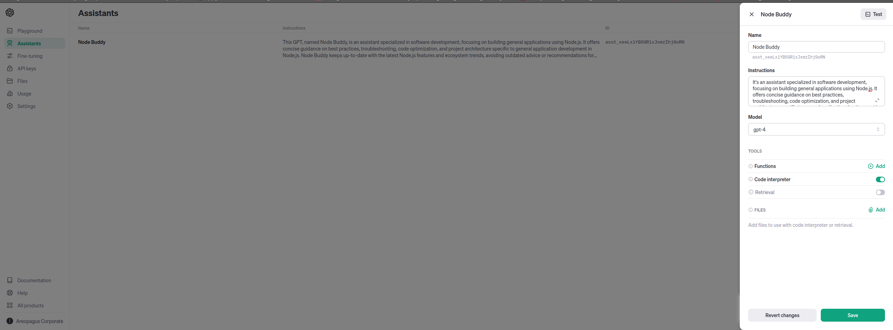
